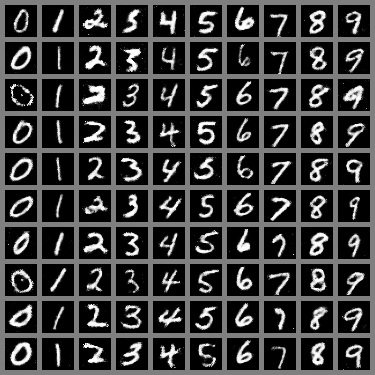

# Jittor 计图挑战热身赛 cGAN
成员：华东理工大学 梁磊、俞贤康、何旭峰
指导教师：华东理工大学 陈志华教授；上海交通大学 盛斌教授

## 简介
本项目包含了第二届计图挑战赛计图 - 草图生成风景比赛的代码实现。本项目的特点是：采用了 **cGAN** 方法对 **随机采样的噪声** 和 **给定数字类别** 进行处理，取得了 生成指定类别数字的图片 的效果，在评测系统上的评分为 **0.9996**，生成的数字样例如下。



## 安装 
本项目在 1 张 3090 上运行，训练时间约为 0.5 小时。

#### 运行环境
- ubuntu 18.04 LTS
- python >= 3.7
- jittor >= 1.3.0

#### 安装依赖
执行以下命令安装 python 依赖；Jittor 安装及测试参考 [计图](https://cg.cs.tsinghua.edu.cn/jittor/download/)
```
pip install -U jittor
pip install numpy
pip install Pillow
```

## 数据预处理
运行时会自动将数据集下载到`~/.cache/jittor/dataset/`目录下，目录名为`mnist_data`，不需要其他数据预处理。

## 训练
修改`scripts/single_gpu.sh`，删除`--eval`后表示进入训练模式。单卡训练可运行以下命令：
```
bash scripts/single_gpu.sh
```
                                       
## 推理
#### 已训练模型
已训练模型的下载地址为 [百度网盘](https://pan.baidu.com/s/1Ivdf5Yossj9vO5Q4PgESVw?pwd=2ju6)，下载两个权重文件后，放入项目目录 `warmup-comp/` 下。
#### 生成图片
修改`scripts/single_gpu.sh`，在`train.py`后添加`--eval`参数，表示进入测试模式；修改`train.py`第 **140** 行为需要生成的手机号。单卡训练可运行以下命令：
```
bash scripts/single_gpu.sh
```

## 致谢
此项目大部分代码参考了 [jittor-gan](https://github.com/Jittor/gan-jittor)。